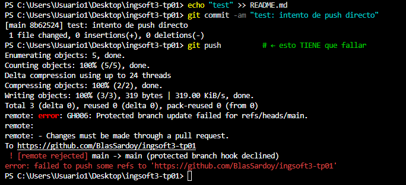
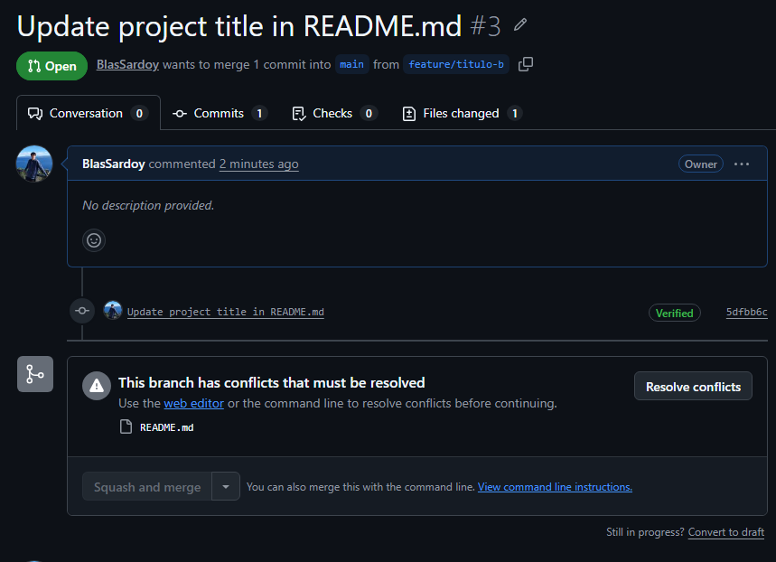
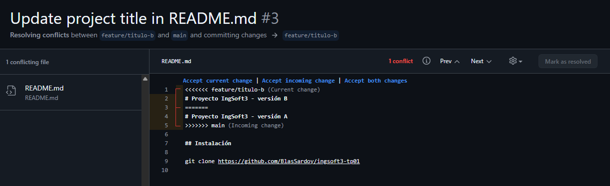
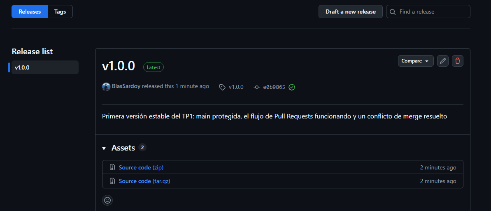
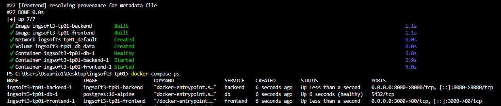
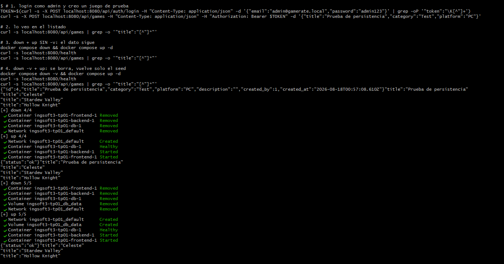
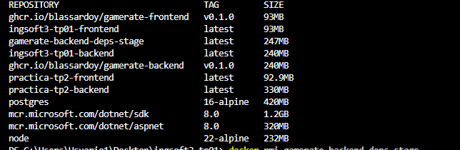
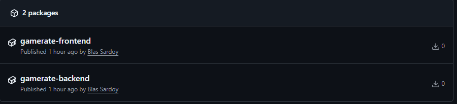

# Evidencias — TP1

## 1. Push directo a main rechazado

GitHub rechaza el intento de `git push` directo a `main` con "protected branch hook declined" — la protección de rama alcanza incluso al dueño del repositorio.

## 2. El PR de la rama B no se puede mergear: conflicto

Al intentar mergear el PR de `feature/titulo-b`, GitHub avisa "This branch has conflicts that must be resolved" porque la rama A ya modificó la misma línea del README.

## 3. Marcadores del conflicto

El editor de conflictos de GitHub muestra los marcadores `<<<<<<<`, `=======` y `>>>>>>>` delimitando la versión de `feature/titulo-b` (arriba) y la versión ya mergeada en `main` (abajo), sobre la primera línea del README.

## 4. Release v1.0.0 publicada

La release `v1.0.0` publicada en GitHub, con las notas describiendo qué incluye: main protegida, el flujo de Pull Requests funcionando y un conflicto de merge resuelto.

## TP2 — Contenedores

### 1. Sistema funcionando end-to-end

`docker compose up -d --build` desde cero: build de las dos imágenes, arranque de los 3 servicios, y `docker compose ps` confirmando los tres `Up` con `db` en `(healthy)`. La API respondiendo en `/health` y `/api/games` queda demostrada en la captura del punto 2, que incluye esos mismos `curl`.

### 2. Prueba de persistencia

Un juego creado a mano desde la terminal sobrevive a `docker compose down` + `up` (el volumen `db_data` queda intacto), y desaparece con `down -v` + `up` (el volumen se borra y sólo quedan los 3 juegos semilla).

### 3. Comparación de tamaño de imágenes

La imagen final del backend (`ingsoft3-tp01-backend`, 240MB, con todo el código adentro) pesa casi lo mismo que la base `node:22-alpine` sola y sin nada (232MB), y menos que la propia etapa `deps` (247MB): el multi-stage evita que la imagen final cargue con la caché de `npm ci` que la etapa de build sí genera.

### 4. Imágenes públicas en el registry

Los dos packages, `gamerate-frontend` y `gamerate-backend`, publicados en `ghcr.io`. Se probó además que bajan de verdad sin sesión (`docker logout` + `docker pull`) y que `docker-compose.registry.yml` levanta el sistema completo solo con estas imágenes, sin el código fuente.
